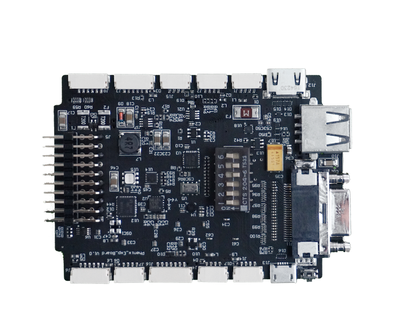

# 
 PhenixPro DevKit: Programability for Networked Unmanned Systems

<iframe width="750" height="450" src="http://www.youtube.com/embed/xCQVF-IcDbg" frameborder="0" allowfullscreen></iframe>

 

<iframe width="560" height="315" src="https://www.youtube.com/embed/xCQVF-IcDbg" frameborder="0" allowfullscreen></iframe>
  

The PhenixPro DevKit is an intelligent control, computing and networking platform for unmanned systems. It integrates a Xilinx Zynq SoC, which packaging a dual core ARM Cortex-A9 CPU and FPGA fabric on a signal chip. PhenixPro DevKit is also running PhenOS\(based on freeRTOS\) and Linux on each CPU core respectively. Attitude estimation, flight control, navigation are implemented by ArduPilot flight control stack \([http://ardupilot.org](http://ardupilot.org)\). So far, it only support quadcopter, we call it flying robot.

* The codebase is hosting on github: [https://github.com/RobSenseTech/PhenixPro\_Devkit.git](https://github.com/RobSenseTech/PhenixPro_Devkit.git).
* The developers' guide is presenting on: [https://guide.robsense.com/](https://guide.robsense.com/).
* and hosting on github: [https://github.com/RobSenseTech/PhenixPro-DevKit-Guide.git](https://github.com/RobSenseTech/PhenixPro-DevKit-Guide.git), so developers can contribute to edit and push modifications.
* Developers can push questions to DevKit user forum at: [http://dev.robsense.com](http://dev.robsense.com)

<!----->

