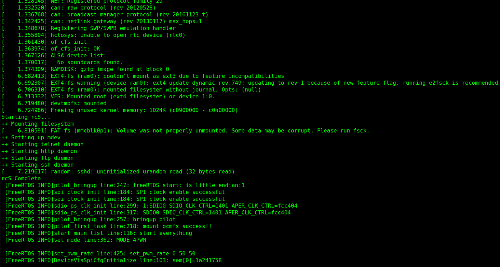
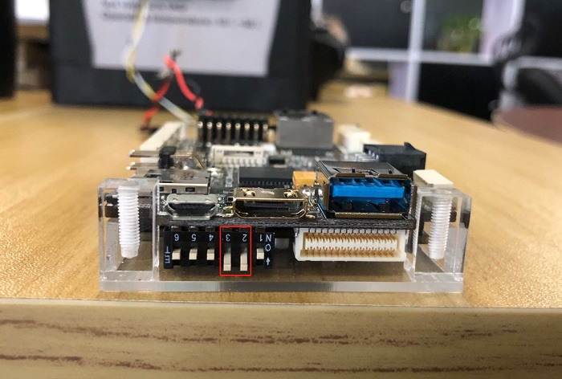

## 1.Boot

Devkit support boot from sd card, copy these file to sd card:

```
1.PhenixPro_Devkit/BOOT.BIN
2.PhenixPro_Devkit/amp_system/linux_image/devicetree.dtb
3.PhenixPro_Devkit/amp_system/linux_image/uImage
4.PhenixPro_Devkit/amp_system/linux_image/uramdisk.image.gz
```
**Note:**
​	The directory of PhenixPro Devkit V2.0 is RobSenseTech/PhenixPro_Devkit_V2.0... 

set DIP switch like the image below(it means boot from sd card):

For PhenixPro Devkit V1.0


Insert SD card to devkit, connect micro usb to PC, open uart tools(recommand SecureCRT) with 115200 baudrate, and power on, you will see print information on console:




For PhenixPro Devkit V2.0



And the he print information is similar to general Linux startup information.


## 2.Connect UAV Components


As red words in image above, we can connect UAV component like this:

- Remote control receiver connect to **SBUS** (pin order from top to bottom is signal, vcc, GND)
- Four motors connected to **MOTO 1 to 4**, respectively (pin order from top to bottom is signal, vcc, GND)
- Ground station can be connected through **SERIAL** **4** port  on the board with baudrate 115200, while through other **SERIAL** ports with baudrate 57600.
- Connect power distribution board to **POWER**
- UAV head direction is the same as x axis which is marked in red box
