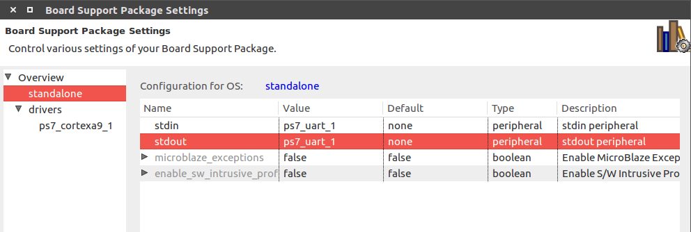
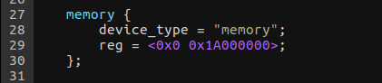

# 2. Build Software

## 2.1 For PhenixPro Devkit V1.0
This chapter will show you a simple demo about running an AMP system(Asymmetric Multi-Processing System) on Devkit, with cpu0 running linux and cpu1 running bare-metal program.(Reference: Xilinx Official Doc **xapp1078-amp-linux-bare-metal.pdf**).

The most important thing is that two cpu should run in different DDR physical address space. Devkit has 512MB DDR, whose physical address range is 0x0 - 0x20000000. In this case, we set 0x0 - 0x19FFFFFF(416MB) as linux space, and 0x1A000000 - 0x1FFFFFFF(96MB) as bare-metal space

### 2.1.0 Principle

Simply put, the principle of Amp system in zynq is cpu0 wake up cpu1, now, let't see how it works:


Cpu0 start first, at the same time, cpu1 running a little piece of code which have been loaded from bootrom to ocm(on chip memory), it watching the value of 0xfffffff0 adress. after linux startup, it will write the code segment first address of cpu1 app into 0xfffffff0. Once cpu1 realize the value is changed to nonzero, then the pc pointer of cpu1 will jump to the adress which is written at 0xfffffff0, this is how the whole system startup.

### 2.1.1 Configure SDK

First of all, download xapp1078.zip from https://www.xilinx.com/search/site-keyword-search.html?searchKeywords=xapp1078 and unzip it. This zip file include standalone BSP files (used by the bare-metal application) and modified FSBL files. To give SDK knowledge of these files, SDK needs to be configured to have knowledge of the new repository.

Now, open Xilinx SDK, indicate a dirctory as workspace and click OK:


Select **Xilinx_tools > Repositories**


select **New** and Browse to and select the directory design\src\sdk_repo, select **OK**


### 2.1.2 Create FSBL Application

Select **File > New > Application_Project**


select **New...** button to indicate the hdf file, click **Finish** and **Next**


select **Zynq FSBL** and click **Finish**

****

**Note: xapp1078-amp-linux-bare-metal.pdf write that select Zynq FSBL for AMP, because FSBL generated by old version SDK don't support amp system**

### 2.1.3 Create Bare-Metal Application For CPU1

The instructions in this section create the application ELF that runs on CPU1 after the FSBL
loads the applications to DDR memory.

First we need to create the BSP for cpu1, select **File > New > Board_Support_Package**. Change CPU to **ps7\_cortexa9\_1** and click **Finish**


in the Board Support Package settings, select **overview > standalone** and change both stdin and stdout to **ps7\_uart\_1**

select **Overview > drivers > cpu_cortexa9\_1** and add **-DUSE_AMP=1** to extra_compiler_flags


​	Now, we can create bare_metal application, select **File > New > Application Project**, set like image below, and click **Finish**:


change the code to a while cycle:


here comes the most important part: modify **ld.scrip** to tell gcc the first address of the code segment 0x1A000000, which we have discussed at the beginning of this chapter. So let's open **ld.script**, and change **ps7\_ddr\_0\_S\_AXI\_BASEADDR** as 0x1A000000, **Size** as 0x1FF00000, **Stack Size** as 0x800000(8MB), **Heap Size** as 0x1000000(16MB), now, we can complie our code.

### 2.1.4 u-boot For CPU0

Get u-boot source code for github:

```
git clone git://github.com/Xilinx/u-boot-xlnx.git
```

As the same with bare-metal application on cpu1, u-boot also need to configure DDR address range(we use zedboard as our default configuration):

- modify CONFIG_SYS_SDRAM_SIZE in zynq_zed.h to (416 * 1024 * 1024)

- modify memory section in devicetree (u-boot-xlnx/arch/arm/dts/zynq-zed.dts):

  

make the configuration effective:

```
make zynq_zed_config
```

complie  u-booot:

```
make ARCH=arm CROSS_COMPILE=arm-xilinx-linux-gnueabi- -j8
```

last step, rename u-boot to u-boot.elf

**Note:** compile error handle:

- fatal error: openssl/evp.h
  install openssl:

  ```
  sudo apt-get install libssl-dev
  ```


- ./bin/sh: 1: dtc: not found
  install dtc:

  ```
  sudo apt-get install device-tree-compiler
  ```

### 2.1.5 Linux Kernel For CPU0

Get kernel code from github:

```
git clone -b master --single-branch https://github.com/Xilinx/linux-xlnx.git
```

compile kernel:

```
make ARCH=arm xilinx_zynq_defconfig
make ARCH=arm UIMAGE_LOADADDR=0x8000 uImage -j8
```

### 2.1.6 Linux Devicetree

We use zedboard devicetree as our default(linux-xlnx/arch/arm/boot/dts/zynq-zed.dts), like steps in u-boot, modify memory section:



generate dtb file with command

```
./scripts/dtc/dtc -I dts -O dtb -o devicetree.dtb arch/arm/boot/dts/zynq-zed.dts
```

### 2.1.7 Linux Filesystem

**Note: **We use **genext2fs** to generate ramdisk, make sure your computer has installed this software(download here:https://sourceforge.net/projects/genext2fs/files/).

Fisrt, download arm_ramdisk.image.gz from http://www.wiki.xilinx.com/Build+and+Modify+a+Rootfs, with these command below, you will have root filesystem in "tmpmnt" directory:

```
gunzip arm_ramdisk.image.gz
chmod u+rwx arm_ramdisk.image
mkdir tmpmnt
sudo mount -o loop arm_ramdisk.image tmpmnt/
```

As we discussed in chapter 3.1, we need **rwmem.elf** to write address 0xfffffff0 in ram, so, let's put it into directory "tmpmnt/usr", and regenerate **.image.gz** file:

```
cp xapp1078/design/generated_files/SDK_apps/rwmem.elf tmpmnt/usr
sudo genext2fs -b 15360 -N 1000 -d tmpmnt ramdisk.image
gzip -9 ramdisk.image
mkimage -A arm -T ramdisk -C gzip -n Ramdisk -d ramdisk.image.gz uramdisk.image.gz
```

### 2.1.8 Create BOOT.bin

This is the last step, let's go back to SDK, select **Xilinx Tools->Create Zynq Boot Image**, add fsbl.elf(chapter 3.3), bit file(chapter 2.3), u-boot.elf(chapter 3.5), hello_world.elf(chapter 3.4), click **Create Image**:


now, you can find BOOT.bin file in your workspace directory

### 2.1.9 Test

Copy BOOT.bin, uImage, devicetree.dtb, and arm_ramdisk.image.gz to SD card, connect usb console, baudrate 115200, set devkit as SD card boot with DIP switch:


power-on devkit.

At first boot, we need to set uboot argument, which let linux only be aware of one cpu:

```
set bootargs 'console=ttyPS0,115200 maxcpus=1 root=/dev/ram rw earlyprintk'
```

After linux boot-up, input command below to terminal, you will see "hello world" print:


## 2.2 For PhenixPro Devkit V2.0
This section will show you a simple way to build software for PhenixPro Devkit V2.0

### 2.2.0 u-boot
Get u-boot source code from github:
```
git clone https://github.com/RobSenseTech/PhenixPro_Devkit_V2.0
cd PhenixPro_Devkit_V2.0/uboot-xlnx
```

Make the configuration effective:
```
make phenixpro_devkit_config
```

Complie u-booot:
```
make ARCH=arm CROSS_COMPILE=arm-xilinx-linux-gnueabi- -j8
```

Last step, rename u-boot to u-boot.elf.And you can use it to create BOOT.bin by SDK.

Note: compile error handle:

fatal error: openssl/evp.h install openssl:
```
sudo apt-get install libssl-dev
```

./bin/sh: 1: dtc: not found install dtc:
```
sudo apt-get install device-tree-compiler
```

### 2.2.1 Linux Kernel
Enter the linux kernel directory:
```
cd PhenixPro_Devkit_V2.0/linux-xlnx-4.9
```

Compile kernel:
```
cp arch/arm/boot/phenixpro-devkit-config/devkit-config .config

make ARCH=arm CROSS_COMPILE=arm-xilinx-linux-gnueabi- menuconfig
Device Drivers  --->
		[*]Pulse-Width Modulation (PWM) Support  --->
		<*>   Xilinx PWM support

make ARCH=arm UIMAGE_LOADADDR=0x8000 CROSS_COMPILE=arm-xilinx-linux-gnueabi- uImage -j8
```

### 2.2.2 Linux Devicetree
Generate dtb file with command
```
cd PhenixPro_Devkit_V2.0/linux-xlnx-4.9
./mkdtb.sh
```

### 2.2.3 Linux Filesystem
Get Linux Filesystem from github:
```
https://github.com/RobSenseTech/PhenixPro_Devkit_Platform
```

generate Linux Filesystem with command
```
cd PhenixPro_Devkit_Platform/filesystem/ramdisk/
./mkramfs.sh rootfs
```
