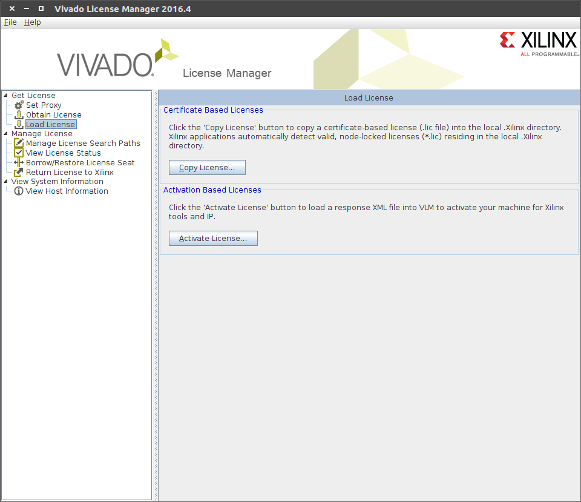
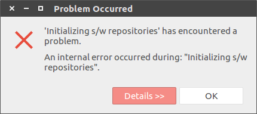
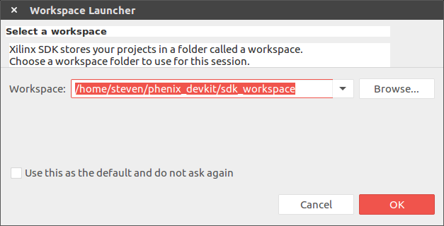
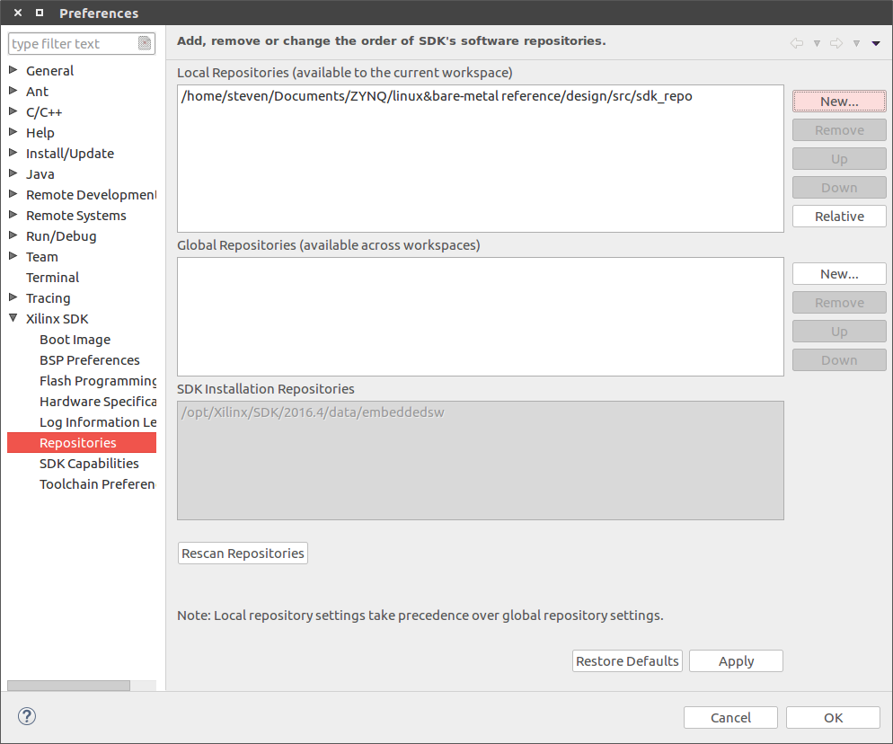
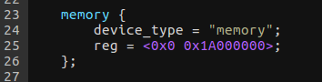
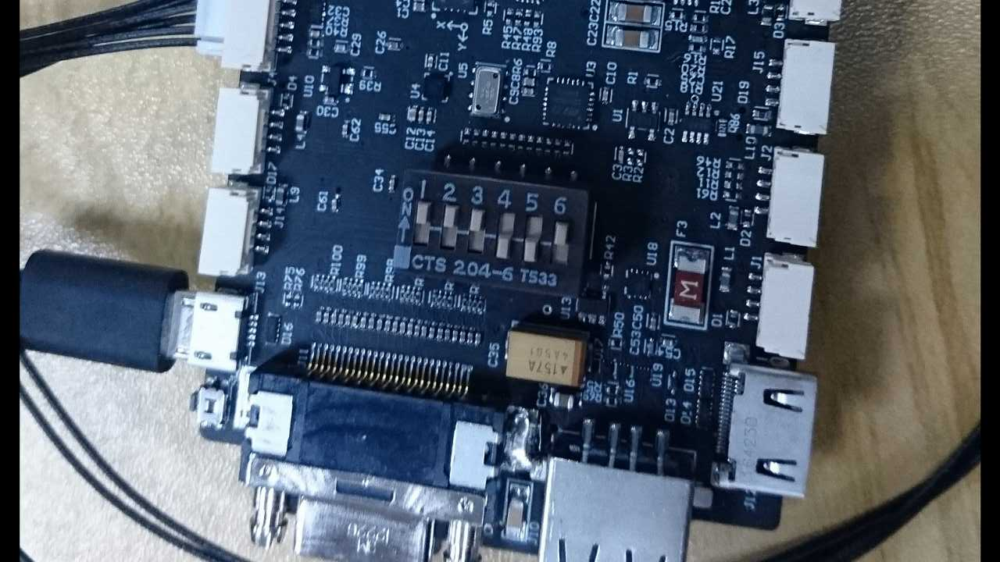
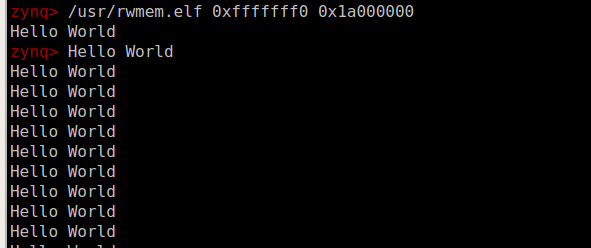

# DevKit Develop Enviroment For Ubuntu16.04

[TOC]

## 1.Install Vivado

### 1.1 Download

Our Vivado version is 2016.4 (Download here:https://www.xilinx.com/support/download.html)

Get Phenix Pro Devkit Firmware from github:

```
git clone https://github.com/RobSenseTech/PhenixPro_Devkit
```

### 1.2 Install Main Program  

First of all, we need to install **the latest version**(8u121) of Java SE Development Kit( Download here http://www.oracle.com/technetwork/java/javase/downloads/jdk8-downloads-2133151.html), then install it:

```
cd [your download path]
tar xf jdk-8u121-linux-x64.tar.gz
vim ~/.bashrc
```

add these statements:

```
export JAVA_HOME=[your jdk path]
export JRE_HOME=${JAVA_HOME}/jre
export CLASSPATH=.:{JAVA_HOME}/lib:${JRE_HOME}/lib
export PATH=${JAVA_HOME}/bin:$PATH
```

use this command to make it work:

```
source ~/.bashrc
```

to comfirm whether jdk is installed properly, use this command:

```
java -version
```

if JDK is installed properly, it will show these information:

```
java version "1.8.0_121"
Java(TM) SE Runtime Environment (build 1.8.0_121-b13)
Java HotSpot(TM) 64-Bit Server VM (build 25.121-b13, mixed mode)
```

now, we can install Vivado:

```
cd [your vivado path]
tar xf Xilinx_Vivado_SDK_2016.4_0124_1.tar.gz
cd Xilinx_Vivado_SDK_2016.4_0124_1
sudo ./xsetup
```

click Next


select three "I Agree" and Next


select third one, click Next


select "Software Development Kit (SDK)", click Next


choose installation directory, click Next


click install


after this, we need to load the license:



click "Load License" and "Copy License" (You can find lic file in firmware path [phenix_devkit path]/amp_system/)


select your license and click open.

the last step, you need to add some enviroment parameter in **.bashrc**:

```
source /opt/Xilinx/Vivado/2016.4/settings64.sh
source /opt/Xilinx/SDK/2016.4/settings64.sh
export PATH=$PATH:/opt/Xilinx/SDK/2016.4/bin
```

### 1.3 Install cable driver

On Windows, Install Cable Drivers is an optional selection in the installer.For Linux, because root or sudo access is required to install drivers, this option has been removed from the Linux installer beginning in Vivado 2015.4. The general Vivado installer can now be run on Linux without root or sudo privileges. To install cable drivers on Linux, there is now a script that must be run as root or sudo post installation.

Script Location: <Vivado Install Dir>/data/xicom/cable_drivers/lin64/install_script/install_drivers/
Script Name: install_drivers

**Reference: ug973-vivado-release-notes-install-license**

### 1.4 Add Vivado SDK to Dash

After steps from 1.1 to 1.3, Vivado SDK has been installed successfully, but in x64 ubuntu, we still cannot find vivado in Dash, so we have to add it by ourselves:

For Vivado:

```
sudo touch /usr/share/applications/vivado.desktop
sudo vim /usr/share/applications/vivado.desktop
```

add these statement:

```
[Desktop Entry]
Encoding=UTF-8
Name=Vivado 2016.4
Exec=[Vivado Install Dir]/Vivado/2016.4/bin/vivado
Terminal=false
Type=Application
Icon=[Vivado Install Dir]/Vivado/2016.4/doc/images/vivado_logo.png
StartupNotify=true
Categories=System;	
```

For SDK:

```
cd [Vivado Install Dir]/SDK/2016.4/eclipse/lnx64.o/
sudo mkdir jre
cd jre 
sudo ln -s [your jdk path]/jre/bin
sudo touch /usr/share/applications/xsdk.desktop
sudo vim /usr/share/applications/xsdk.desktop
```

add these statement:

```
[Desktop Entry]
Encoding=UTF-8
Name=SDK 2016.4
Exec=xsdk
Terminal=false
Type=Application
Icon=[Vivado Install Dir]/SDK/2016.4/data/sdk/images/sdk_logo.png
StartupNotify=true
Categories=System;
```

**Note: **

**When launch SDK in Dash, it shows this error, it means you have to launch sdk with shell command "xsdk", otherwise, you may find that you can't close SDK**:

****

**If you launch SDK in terminal with command "xsdk", and there is nothing happen, but show information below:**

```
****** Xilinx Software Development Kit
****** SDK v2016.4 (64-bit)
  **** SW Build 1733598 on Wed Dec 14 22:35:42 MST 2016
    ** Copyright 1986-2016 Xilinx, Inc. All Rights Reserved.

Launching SDK with command /opt/Xilinx/SDK/2016.4/eclipse/lnx64.o/eclipse -vmargs -Xms64m -Xmx512m -Dorg.eclipse.swt.internal.gtk.cairoGraphics=false
```

**then, you need to add these 2 lines to [Vivado Install Dir]/SDK/2016.4/eclipse/lnx64.o/eclipse.ini before statement "-vmargs"**

```
--launcher.GTK_version
2
```

**just like this:**


****

## 2.Build Minimum System Hardware

### 2.1 Install Board Interface File

(Reference: ug895-vivado-system-level-design-entry.pdf Appx.A)

After installing Vivado, the installation directory will contain a folder called **board_files**. This folder contains XML files for different FPGA boards manufactured by Xilinx. 

XML files define different interfaces on the board. Interfaces such as UART, DDR Memory, Ethernet etc. For example, we use IP core AXI UART16550, but it has 14pins by default, there are only 2 pins in our devkit for uart, so we have to custom the interface of the IP core through XML. After installing board interface file, we will be able to assign different inerfaces that are available on your selected board to a specific IP block:


Robsense has written these XML files, they are stored in our firmware project, all you need is just get it from github, and copy then into path **board_files**:

```
cd [phenix_devkit path]/amp_system/
tar xf vivado_prj.tar.gz
sudo cp vivado_prj/phenix_devkit [Vivado Install Dir]/Vivado/2016.4/data/boards/board_files -r
```


**Note:** If you are interested in how to write the XML, you can reference Chapter Appx.A in Xilinx offical document **UG895 **(https://www.xilinx.com/support/documentation/sw_manuals/xilinx2016_4/ug895-vivado-system-level-design-entry.pdf).

### 2.2 Create Project

(Reference:http://zedboard.org/zh-hant/node/1454)

Open Vivadio and click "Create New Project", input project name, and click Next


select "RTL Project"


click Next until the UI below


click **Boards **find Phenix Pro Devkit, click Next and then click finish:

**Note:** If you can't find Phenix Pro Devkit, please make sure that you installed board interface files right in section 2.1


click "Create Block Design", input design name, and click "OK"


### 2.3  Create Minimum System Design

Now we have a empty design, let's add IP to it


click and input zynq to search "ZYNQ Processing System",  double click to add it to our design, and click **Run Block Automation**, Vivado will configure PS core with board interface files which we installed int 2.1

now, the PS core should be like this :


connect an input signal for AXI, like the image below:


Now, we've created our PS within the IPI block, next, we need to create an HDL wrapper for the Vivado synthesizer knows what to do with our IP block


right mouse click and select "Create HDL Wrapper",This will generate a HDL wrapper that the Vivado synthesizer understands.  Once this happens, we are ready to generate our bitfile. This might sound like a large jump, but there isn't anything else in our design - it's almost entirely PS (the only PL portion is that AXI 
port support logic).

next, we need to set "Top moudule name", click "Synthesis Settings"and "..."button, select phenix_devkit_wrapper:


At last, click "Run Synthesis", "Run Implementation" and "Generate Bitstream" to generate PL program

### 2.4 Export hdf(hardware definition file) file

If we want to develop on PS with Xilinx SDK, we need to tell SDK how our hardware looks like, which is the usage of the hdf file. Exporting hdf file is quite simple, just click **File->Export->Export Hardware**, and choose the path you want to store the hdf file(don't forget include bitstream file):


now, we can launch SDK to generate FSBL and BSP(chapter 3.3,3.4)

## 3.Run AMP(Asymmetric Multi-Processing System) on Devkit

This chapter will show you a simple demo about running an AMP system on Devkit, with cpu0 running linux and cpu1 running bare-metal program.(Reference: Xilinx Official Doc **xapp1078-amp-linux-bare-metal.pdf**). 

The most important thing is that two cpu should run in different DDR physical address space. Devkit has 512MB DDR, whose physical address range is 0x0 - 0x20000000. In this case, we set 0x0 - 0x19FFFFFF(416MB) as linux space, and 0x1A000000 - 0x1FFFFFFF(96MB) as bare-metal space

### 3.1 Principle

Simply put, the principle of Amp system in zynq is cpu0 wake up cpu1, now, let't see how it works:


Cpu0 start first, at the same time, cpu1 running a little piece of code which have been loaded from bootrom to ocm(on chip memory), it watching the value of 0xfffffff0 adress. after linux startup, it will write the code segment first address of cpu1 app into 0xfffffff0. Once cpu1 realize the value is changed to nonzero, then the pc pointer of cpu1 will jump to the adress which is written at 0xfffffff0, this is how the whole system startup.

### 3.2 Configure SDK

First of all, download xapp1078.zip from https://www.xilinx.com/search/site-keyword-search.html?searchKeywords=xapp1078 and unzip it. This zip file include standalone BSP files (used by the bare-metal application) and modified FSBL files. To give SDK knowledge of these files, SDK needs to be configured to have knowledge of the new repository.

Now, open Xilinx SDK, indicate a dirctory as workspace and click OK:



Select **Xilinx_tools > Repositories**


select **New** and Browse to and select the directory design\src\sdk_repo, select **OK**



### 3.3 Create FSBL Application

Select **File > New > Application_Project**


select **New...** button to indicate the hdf file, click **Finish** and **Next**


select **Zynq FSBL** and click **Finish**

****

**Note: xapp1078-amp-linux-bare-metal.pdf write that select Zynq FSBL for AMP, because FSBL generated by old version SDK don't support amp system** 

### 3.4 Create Bare-Metal Application For CPU1

The instructions in this section create the application ELF that runs on CPU1 after the FSBL
loads the applications to DDR memory.

First we need to create the BSP for cpu1, select **File > New > Board_Support_Package**. Change CPU to **ps7\_cortexa9\_1** and click **Finish**


in the Board Support Package settings, select **overview > standalone** and change both stdin and stdout to **ps7\_uart\_1**

select **Overview > drivers > cpu_cortexa9\_1** and add **-DUSE_AMP=1** to extra_compiler_flags


​	Now, we can create bare_metal application, select **File > New > Application Project**, set like image below, and click **Finish**:


change the code to a while cycle:


here comes the most important part: modify **ld.scrip** to tell gcc the first address of the code segment 0x1A000000, which we have discussed at the beginning of this chapter. So let's open **ld.script**, and change **ps7\_ddr\_0\_S\_AXI\_BASEADDR** as 0x1A000000, **Size** as 0x1FF00000, **Stack Size** as 0x800000(8MB), **Heap Size** as 0x1000000(16MB), now, we can complie our code.

### 3.5 u-boot For CPU0

Get u-boot source code for github:

```
git clone git://github.com/Xilinx/u-boot-xlnx.git
```

As the same with bare-metal application on cpu1, u-boot also need to configure DDR address range(we use zedboard as our default configuration):

- modify CONFIG_SYS_SDRAM_SIZE in zynq_zed.h to (416 * 1024 * 1024)

- modify memory section in devicetree (u-boot-xlnx/arch/arm/dts/zynq-zed.dts):

  

make the configuration effective:

```
make zynq_zed_config
```

complie  u-booot:

```
make ARCH=arm CROSS_COMPILE=arm-xilinx-linux-gnueabi- -j8
```

last step, rename u-boot to u-boot.elf

**Note:** compile error handle:

- fatal error: openssl/evp.h
  install openssl:

  ```
  sudo apt-get install libssl-dev
  ```


- ./bin/sh: 1: dtc: not found
  install dtc:

  ```
  sudo apt-get install device-tree-compiler
  ```

### 3.6 Linux Kernel For CPU0

Get kernel code from github:

```
git clone -b master --single-branch https://github.com/Xilinx/linux-xlnx.git
```

compile kernel:

```
make ARCH=arm xilinx_zynq_defconfig
make ARCH=arm UIMAGE_LOADADDR=0x8000 uImage -j8
```

### 3.7 Linux Devicetree

We use zedboard devicetree as our default(linux-xlnx/arch/arm/boot/dts/zynq-zed.dts), like steps in u-boot, modify memory section:


generate dtb file with command

```
./scripts/dtc/dtc -I dts -O dtb -o devicetree.dtb arch/arm/boot/dts/zynq-zed.dts
```

### 3.8 Linux Filesystem

**Note: **We use **genext2fs** to generate ramdisk, make sure your computer has installed this software(download here:https://sourceforge.net/projects/genext2fs/files/).

Fisrt, download arm_ramdisk.image.gz from http://www.wiki.xilinx.com/Build+and+Modify+a+Rootfs, with these command below, you will have root filesystem in "tmpmnt" directory:

```
gunzip arm_ramdisk.image.gz
chmod u+rwx arm_ramdisk.image
mkdir tmpmnt
sudo mount -o loop arm_ramdisk.image tmpmnt/
```

As we discussed in chapter 3.1, we need **rwmem.elf** to write address 0xfffffff0 in ram, so, let's put it into directory "tmpmnt/usr", and regenerate **.image.gz** file:

```
cp xapp1078/design/generated_files/SDK_apps/rwmem.elf tmpmnt/usr
sudo genext2fs -b 15360 -N 1000 -d tmpmnt ramdisk.image
gzip -9 ramdisk.image
mkimage -A arm -T ramdisk -C gzip -n Ramdisk -d ramdisk.image.gz uramdisk.image.gz
```

### 3.9 Create BOOT.bin

This is the last step, let's go back to SDK, select **Xilinx Tools->Create Zynq Boot Image**, add fsbl.elf(chapter 3.3), bit file(chapter 2.3), u-boot.elf(chapter 3.5), hello_world.elf(chapter 3.4), click **Create Image**:


now, you can find BOOT.bin file in your workspace directory

### 3.10 Test

Copy BOOT.bin, uImage, devicetree.dtb, and arm_ramdisk.image.gz to SD card, connect usb console, baudrate 115200, set devkit as SD card boot with DIP switch:



power-on devkit.

At first boot, we need to set uboot argument, which let linux only be aware of one cpu: 

```
set bootargs 'console=ttyPS0,115200 maxcpus=1 root=/dev/ram rw earlyprintk'
```

After linux boot-up, input command below to terminal, you will see "hello world" print:



