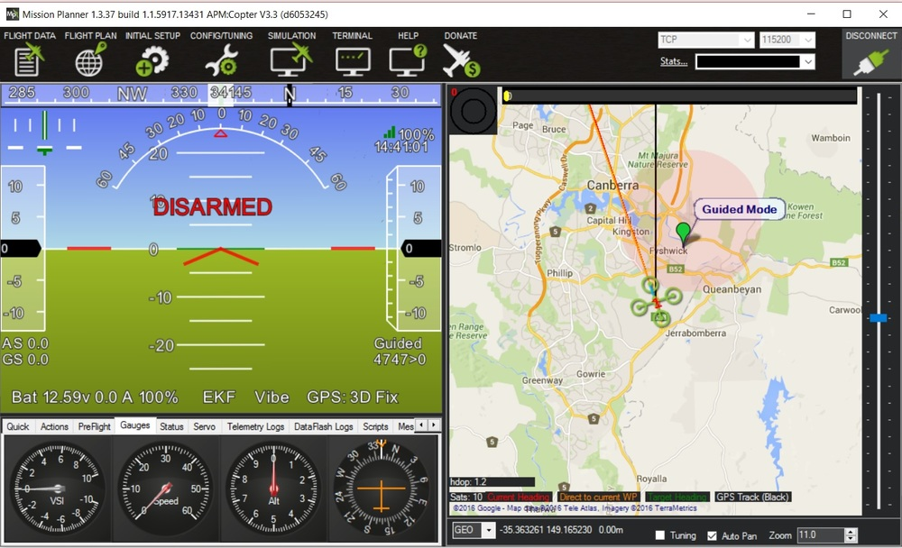
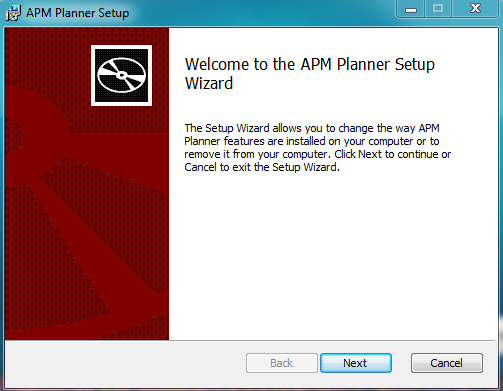

# Install Mission Planner

## Mission Planner Overview

_Mission Planner_ is a full-featured ground station application for the ArduPilot open source autopilot project. This article comes from ardupilot website.To learn more about _mission planner_, click [here](http://ardupilot.org/planner/index.html).

### What is Mission Planner

_Mission Planner_ is a ground control station for Plane, Copter and Rover. It is compatible with Windows only. _Mission Planner_ can be used as a configuration utility or as a dynamic control supplement for your autonomous vehicle.

## Installing Mission Planner

### Download the most recent Mission Planner installer file \#\#\#

Download the [latest Mission Planner installer from here](http://firmware.ardupilot.org/Tools/MissionPlanner/MissionPlanner-latest.msi).

### Run the installation utility

Open the Microsoft installer file \(.msi\) and select **Run** to run the installation utility.

Follow the instructions to complete the setup process. The installation utility will automatically install any necessary software drivers. If you receive a DirectX installation error, please update your DirectX plug-in from the DirectX Download Center.

If you receive the warning pictured here, select **Install this driver software anyway** to continue.

_Mission Planner_ is normally installed in the **C:\Program Files \(x86\)\APM Planner** folder or the **C:\Program Files\APM Planner** folder. That is where your log files folder is located.

An icon to open the _Mission Planner_ is created according to your instructions during the installation.

