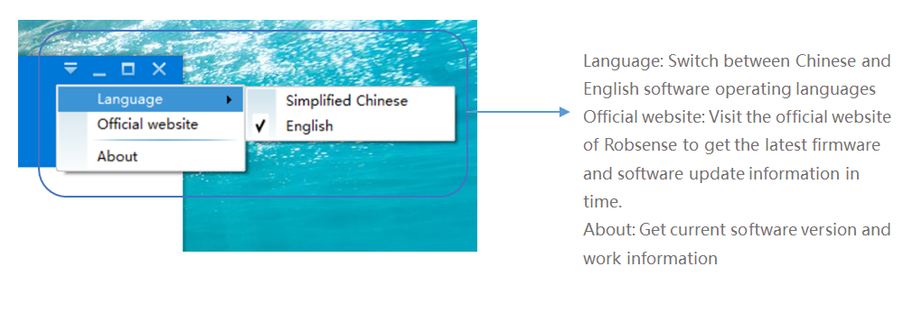

# Function Introduction

## NetWork

### Select firmware version

  
After the software is started, the firmware selection popup window will pop up by default. Please select the flight control version of the current drone and click "Settings".  
If you have selected the firmware version, you can select "Ignore" and open the software directly.  
If you select "Do not display this prompt message next time", the software startup will no longer have a pop-up prompt. If necessary, you can modify it in the "System Settings" tab.

### Open Serial Port

  
After connecting the SwarmLink gateway to the PC with the serial port tool, the software will automatically identify the serial port number of the serial device that has been connected.  
After selecting the serial port number, click "Open" and the progress bar in the lower right corner will light up, prompting "Open the serial port successfully".

### Online drone list

### Signal quality monitoring

 In the "Online drones" list, select a node and click the "Start Measurement" button to monitor the signal quality of the networking node.

## SWARM

### Single drone control

### Path planning interface

  
The map on the right side of the "SWARM" tab is used to perform path planning flight for a single drone. For the list of nodes on the left side, please select a single drone.  
Then in the map on the right, click the right mouse button to plan several flight points in advance. Take off the drone and click on "GOTO" to fly to the set target point.  
The map uses Microsoft bing as the source. If you need to plan the flight, it is recommended to guarantee the Internet connection of EasySwarm.  
  
EasySwarm 2.0 supports importing drone swarm files and executing flight plans in sequence at regular intervals. The flight plan demo files are in the software root directory\(SwarmPlan-3Drones.csv\).  
Note: Before performing a swarm flight, it is recommended to perform a single takeoff and landing test and ensure that the drone MAC in the flight plan file is consistent with the MAC in the online node list.  

## SETTING

### Firmware selection

### Drone MAC modification

### Gateway whitelist management

## other

